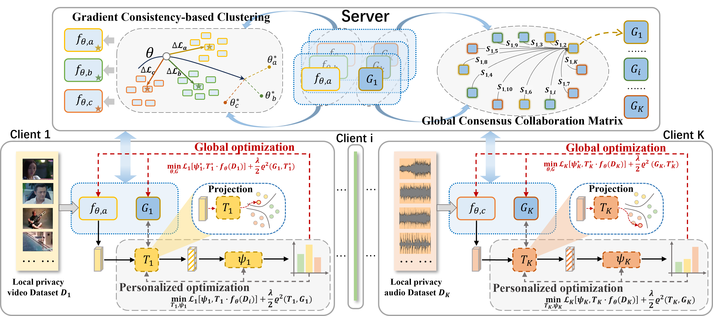

# M3FED
# Cross-Modal Meta Consensus for Heterogeneous Federated Learning [[PDF Download]()]

<div align="center">
  
</div>
<p align="center"><em>The network architecture of the proposed framework. Client side: Localized Training Via Dual-level Optimization. Server-side: Cross Modal Meta Aggregation. 𝑓𝜃 is the meta learner, and 𝐺 is the shared consensus operator.</em></p>

## Installation Guide

### Environment
 We manage environments with Conda. To set up the environment, follow these steps:
```
pip install -r requirements.txt
```


## Preprocess dataset


## References

Thanks for the creative ideas of the pioneer researches:

- https://github.com/KarhouTam/Per-FedAvg

## Citing our work

The preprint can be cited as follows

```bibtex
@inproceedings{li2024cross,
  title={Cross-Modal Meta Consensus for Heterogeneous Federated Learning},
  author={Li, Shuai and Qi, Fan and Zhang, Zixin and Xu, Changsheng},
  booktitle={Proceedings of the 32nd ACM International Conference on Multimedia},
  pages={975--984},
  year={2024}
}
```
